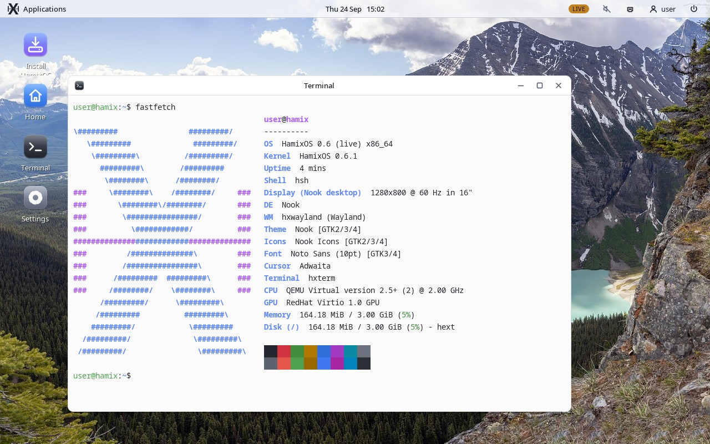
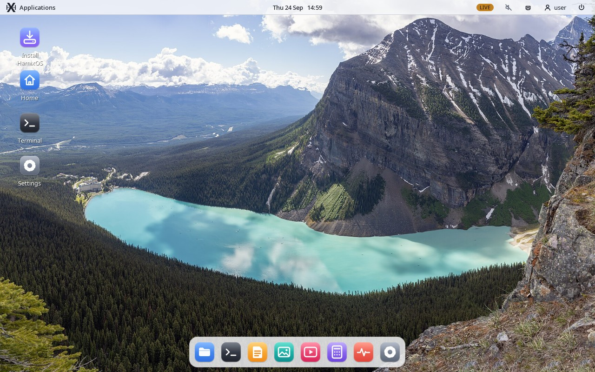
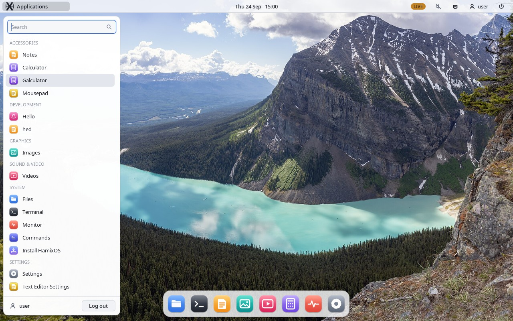
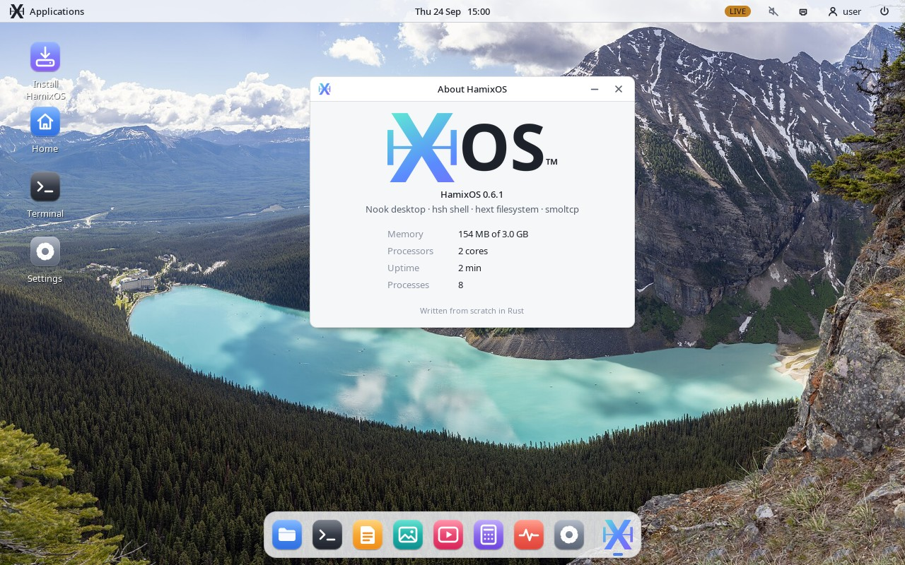

<div align="center">


# HamixOS

**A desktop operating system written from scratch in Rust — its own kernel, its own shell, its own desktop, and room for your Linux apps.**

[](LICENSE)


[Screenshots](#-screenshots) ·
[Features](#-features) ·
[Get started](#-get-started) ·
[Build](#-build-from-source) ·
[Hardware](#-hardware) ·
[Docs](#-documentation)



</div>

---

## 📸 Screenshots

<table>
  <tr>
    <td width="50%"></td>
    <td width="50%"></td>
  </tr>
  <tr>
    <td align="center"><b>Nook</b> in the light style</td>
    <td align="center">Compact application menu, grouped by category</td>
  </tr>
  <tr>
    <td width="50%"></td>
    <td width="50%"></td>
  </tr>
  <tr>
    <td align="center"><b>About HamixOS</b> with the new logo</td>
    <td align="center"><b>Nook Icons</b> — one style for system and Linux apps</td>
  </tr>
</table>

## ✨ Features

<table>
<tr>
<td width="50%" valign="top">

### 🧠 Own kernel
- 64-bit kernel in `no_std` Rust, SMP, preemptive threads
- **hext** — its own journaled filesystem
- **hxinit** — parallel boot with a clear status for every unit
- Loadable **driver modules** with a stable KPI, W^X, per-module memory budget and a watchdog

</td>
<td width="50%" valign="top">

### 🪟 Nook desktop
- Compositing window manager with snapping, animations and a dock
- Light and dark styles, wallpapers, notifications, Wi-Fi and sound menus
- Application menu built from `.desktop` files — installed apps show up by themselves
- **Nook Icons** theme shared with GTK apps

</td>
</tr>
<tr>
<td valign="top">

### 🐧 Linux apps
- Runs unmodified Alpine Linux programs through the Linux ABI layer
- Wayland (`hxwayland`) and X11 (Xwayland) for GTK and Qt apps
- **pantry** package manager: `pantry install mousepad`
- Tested: LibreOffice, Telegram Desktop, Chromium, Thunar, Mousepad, fastfetch, btop

</td>
<td valign="top">

### 🧰 Native apps
- **hsh** shell with scripts, pipes and background jobs
- Terminal, Files, Notes, Images, Videos (own H.264/AAC decoder), Calculator, Monitor, Settings
- Graphical installer with a real bootloader setup
- Networking on smoltcp: Ethernet, Wi-Fi (WPA2), DHCP, DNS

</td>
</tr>
</table>

## 🚀 Get started

1. Download `hamix_os.iso` from the [Releases](https://github.com/mardner4ik/HamixOS/releases) page (or [build it](#-build-from-source)).
2. Write it to a USB stick (`dd`, [Ventoy](https://www.ventoy.net) or balenaEtcher) and boot it, or run it in QEMU:

```bash
qemu-system-x86_64 -M q35 -m 2G -smp 2 -enable-kvm \
    -cdrom hamix_os.iso -boot d \
    -device virtio-vga -nic user,model=e1000
```

3. Log in and start the desktop:

| account | password |
|---------|----------|
| `user`  | `user`   |
| `root`  | `hamix`  |

```
user@hamix:~$ startx
```

4. Double-click **Install HamixOS** on the desktop to put the system on a disk.

> [!TIP]
> Install Linux software with `pantry install <package>` — the package appears in the application menu with its icon a few seconds later.

## 🛠 Build from source

<details>
<summary><b>Requirements</b></summary>

- Rust nightly with `rust-src`
- `grub-mkrescue`, `grub-mkimage` (i386-pc), `xorriso`, `gzip`
- `clang` and `ld.lld` for the C driver modules
- for regenerating the desktop artwork: Python 3 with Pillow and numpy, `rsvg-convert`, the Noto fonts

</details>

```bash
git clone https://github.com/mardner4ik/HamixOS.git
cd HamixOS
./build.sh                                  # kernel, modules, apps, live image, ISO
./build.sh aarch64                          # or riscv64
python3 tools/nook-assets/generate.py       # icons, Nook Icons, fonts, wallpapers
```

`HAMIX_EXTRA=/some/dir ./build.sh` copies a directory on top of the live root
filesystem — handy for videos, test files or prebuilt Linux packages.

## 💻 Hardware

| | Supported |
|---|---|
| **Graphics** | Intel GMA X3000/X3100/4500MHD (`intel-gma`), Intel HD 2000 – UHD 630 (`intel-display`), virtio-gpu, any UEFI/VBE framebuffer |
| **Network** | Intel e1000 and e1000e (I217/I218/I219), Marvell Yukon-2, Qualcomm Atheros AR9285 Wi-Fi, virtio-net |
| **Storage** | AHCI SATA, IDE, virtio-blk |
| **Input** | PS/2 keyboard and touchpad, USB HID over xHCI/UHCI, virtio-input |
| **Sound** | Intel HDA, AC'97 |

Tested on a Samsung R428 and a Lenovo ThinkPad L560, and in QEMU on x86_64, aarch64 and riscv64.

## 📚 Documentation

| | |
|---|---|
| [INSTALL](docs/INSTALL.md) | installing to a disk and the boot process |
| [HSH](docs/HSH.md) · [COMMANDS](docs/COMMANDS.md) | the shell and the command registry |
| [HEXT](docs/HEXT.md) · [HXINIT](docs/HXINIT.md) | filesystem and system startup |
| [XORG](docs/XORG.md) | Nook and the window protocol |
| [MODULES](docs/MODULES.md) · [KPI_ROADMAP](docs/KPI_ROADMAP.md) | driver modules and the kernel programming interface |
| [NETWORK](docs/NETWORK.md) · [AUDIO](docs/AUDIO.md) · [VIDEO](docs/VIDEO.md) | networking, sound, video |
| [LINUXULATOR](docs/LINUXULATOR.md) · [PANTRY](docs/PANTRY.md) | running Linux programs and installing packages |
| [PORTING](docs/PORTING.md) | the aarch64 and riscv64 ports |
| [CHANGES](CHANGES.md) | release notes |

## 🗂 Repository

```
kernel/        the kernel: memory, scheduler, syscalls, VFS, drivers, Linux ABI
drivers/       loadable driver modules (Rust and Linux C drivers)
apps/          native programs: hsh, Nook (hxserver), hxwayland, Files, Terminal, …
libs/ sdk/     shared crates: GUI toolkit, codecs, filesystem, KPI and app SDKs
overlay/       files copied into the root filesystem: themes, icons, wallpapers
tools/         asset generator, Linux sysroot and test helpers
```

## 📄 License

HamixOS is released under the **GNU GPLv3**. Bundled third-party code keeps its
own license: smoltcp (0BSD), the Linux e1000e driver (GPL-2.0), Atheros HAL
tables (ISC), rust_h264 (MIT/Apache-2.0), shiguredo_mp4 (Apache-2.0), the
Symphonia AAC decoder (MPL-2.0). Wallpaper photographs are from Wikimedia
Commons, credits in `overlay/usr/share/wallpapers/CREDITS`.

<div align="center">
<sub>Made with 🦀 and Rust</sub>
</div>
